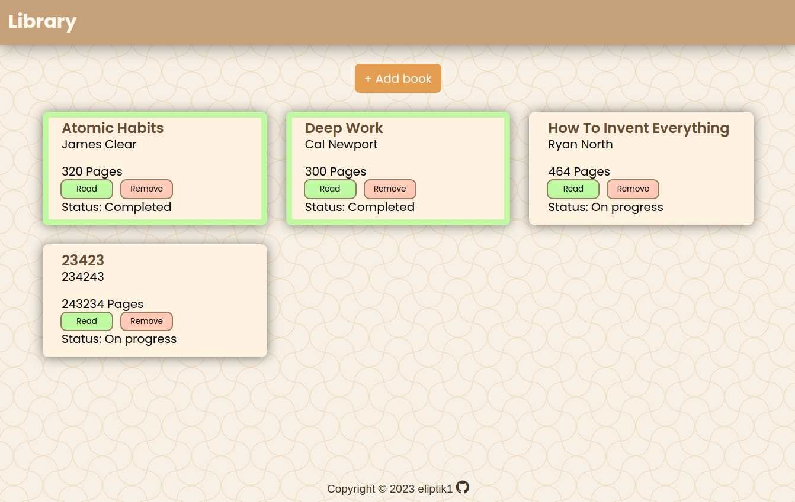
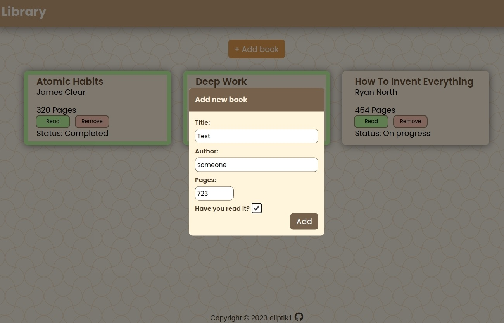

# Library

This is a basic admin dashboard created using HTML and CSS.

## Technologies Used

- HTML
- CSS
- Javascript
- Git

## Features

- **Book Management:** Easily add and remove books from your library, allowing for efficient cataloging.
- **Read Status Tracking**: Keep tabs on your reading progress by changing the read status of books as you go.
- **Data Validation**: Implement custom validation to ensure accurate and consistent book information entry.
- **Local Data Storage**: Utilize local storage functionality to save and retrieve your library data, providing a seamless user experience.
- **User-Friendly Design**: Enjoy a simple and intuitive user interface and user experience design, making your library app straightforward and enjoyable to use.

## Demo

Check out the live demo: [Library Demo](https://eliptik1.github.io/library/)

## Screenshots

## License

This project is open-source and available under the MIT License.
